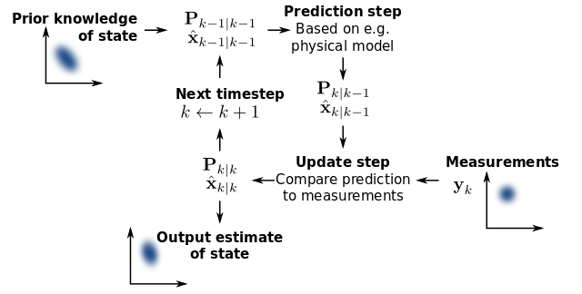

# Kalman Quaternion Rotation 6-DoF IMU

Standard Kalman Filter implementation, Euler to Quaternion conversion, and visualization of spatial rotations.


## Software

- Python with Numpy and [OpenGL](https://github.com/thecountoftuscany/PyTeapot-Quaternion-Euler-cube-rotation)
- Arduino C with [LSM6DS3 driver](https://github.com/sparkfun/SparkFun_LSM6DS3_Arduino_Library)

## Hardware

- 6 DoF IMU - LSM6DS3 (on-board accelerometer and gyroscope)
- Microcontroller - Arduino UNO

## Standard Kalman Filter



Minimalist implementation in less than 30 lines:

```python
"""
x -> state estimate;
z -> state measurement;
F -> state-transition model;
H -> observation model;
P -> process covariance;
Q -> covariance of the process noise;
R -> covariance of the observation noise;
K -> kalman gain;
"""

class KalmanFilter:
    def __init__(self, x0, F, H, P, Q, R):
        self.F = F
        self.H = H
        self.P = P
        self.Q = Q
        self.R = R
        self.x = x0

    def predict(self):
        self.x = self.F @ self.x
        self.P = self.F @ self.P @ self.F.transpose() + self.Q

    def correct(self, z):
        self.K = self.P @ self.H.transpose() @ inverse(self.H @ self.P @ self.H.transpose() + self.R)
        self.x = self.x + self.K @ (z - self.H @ self.x)

        I = np.identity(self.F.shape[1])
        self.P = (I - self.K @ self.H) @ self.P

        return self.x

    def update_state_transition(self, F):
        self.F = F

    def normalize_x(self, x):
        self.x = x
```

## Rotation Conversions

```
Rotation sequence -> XYZ
roll -> phi (x)
pitch -> theta (y)
yaw -> omega (z)
```

```python
def euler_to_quaternion(roll, pitch, yaw):
    """Convert Euler angles to Quaternion"""

    q_w = np.cos(roll / 2) * np.cos(pitch / 2) * np.cos(yaw / 2) + np.sin(roll / 2) * np.sin(pitch / 2) * np.sin(yaw / 2)
    q_x = np.sin(roll / 2) * np.cos(pitch / 2) * np.cos(yaw / 2) - np.cos(roll / 2) * np.sin(pitch / 2) * np.sin(yaw / 2)
    q_y = np.cos(roll / 2) * np.sin(pitch / 2) * np.cos(yaw / 2) + np.sin(roll / 2) * np.cos(pitch / 2) * np.sin(yaw / 2)
    q_z = np.cos(roll / 2) * np.cos(pitch / 2) * np.sin(yaw / 2) - np.sin(roll / 2) * np.sin(pitch / 2) * np.cos(yaw / 2)

    return q_w, q_x, q_y, q_z

def quoternion_to_euler(q_w, q_x, q_y, q_z):
    """Convert Quaternion to Euler angles"""

    phi = np.degrees(np.arctan2(2 * (q_w * q_x + q_y * q_z), 1 - 2 * (q_x ** 2 + q_y ** 2)))
    theta = np.degrees(np.arcsin(2 * (q_w * q_y - q_z * q_x)))
    omega = np.degrees(np.arctan2(2 * (q_w * q_z + q_x * q_y), 1 - 2 * (q_y ** 2 + q_z ** 2)))

    return phi, theta, omega

def acceleration_to_attitude(accelerometer_x, accelerometer_y, accelerometer_z):
    """Calculate roll and pitch angles from normalized (calibrated, filtered) accelerometer readings. (Measurement for Kalman) """

    # Assuming the object is hovering
    roll = np.arcsin(accelerometer_x / g)
    pitch = -np.arcsin(accelerometer_y / (g * np.cos(roll)))
    yaw = 0

    return roll, pitch, yaw
```

## Resources

[Euler Angles, Quaternions, Attitude Estimation](http://www.chrobotics.com/library)

[Maths - Rotations](http://www.euclideanspace.com/maths/geometry/rotations/index.htm)

[Accelerometers, Tilt Sensing, NXP](https://www.nxp.com/docs/en/application-note/AN3461.pdf)

[Sensor Fusion Kalman Filters, NXP](https://www.nxp.com/docs/en/application-note/AN5023.pdf)

[Navigation Filter Best Practices, NASA](https://ntrs.nasa.gov/api/citations/20180003657/downloads/20180003657.pdf)
